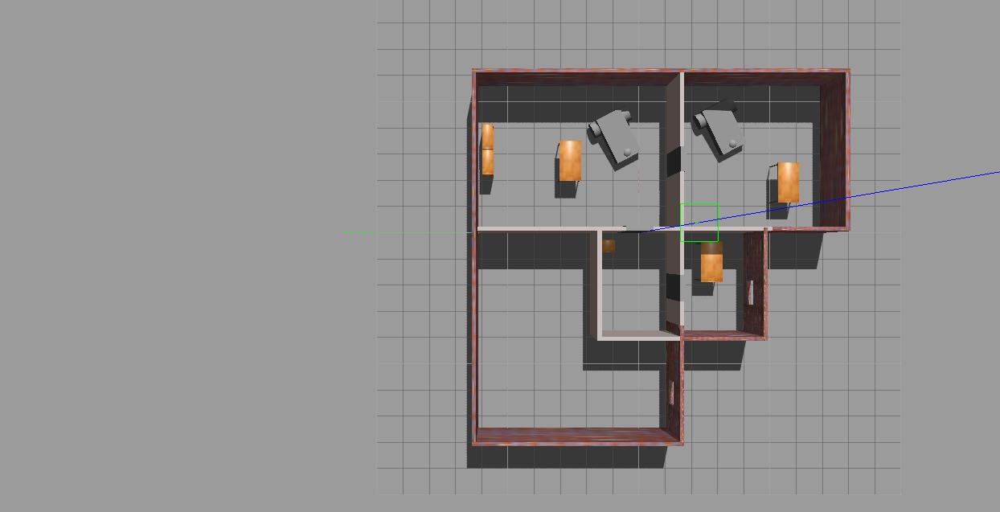
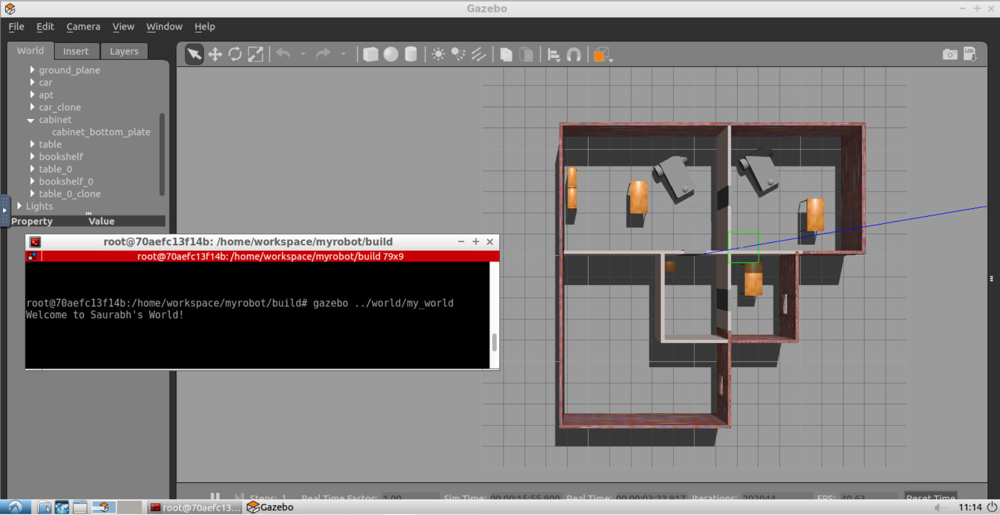

# Build My World

Contains the souce files for my submission for Project 1 of the Udacity Robotics ND program. 

## Tasks

- Build a single floor wall structure using the Building Editor tool in Gazebo. Apply at least one feature, one color, and optionally one texture to your structure. Make sure there's enough space between the walls for a robot to navigate.

- Model any object of your choice using the Model Editor tool in Gazebo. Your model links should be connected with joints. 

- Import at least one model from the Gazebo online library and implement it in your existing Gazebo world.

-  Write a C++ World Plugin to interact with your world. Your code should display “Welcome to ’s World!” message as soon as you launch the Gazebo world file.

## Output

The model is a simple vehicle with a depth camera attached. Lots of interesting possibilities here.

The world is a single level apartment, with multiple rooms separated by walls/doors and windows. Gazebo online library models include a couple of tables, bookshelves and a cabinet

### Gazebo World

### Plugin Output
